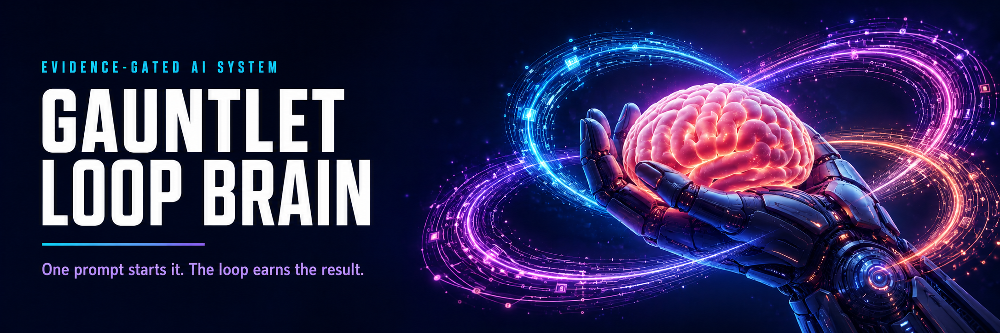
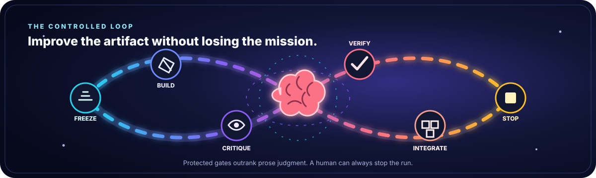
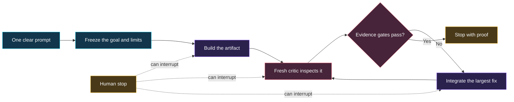
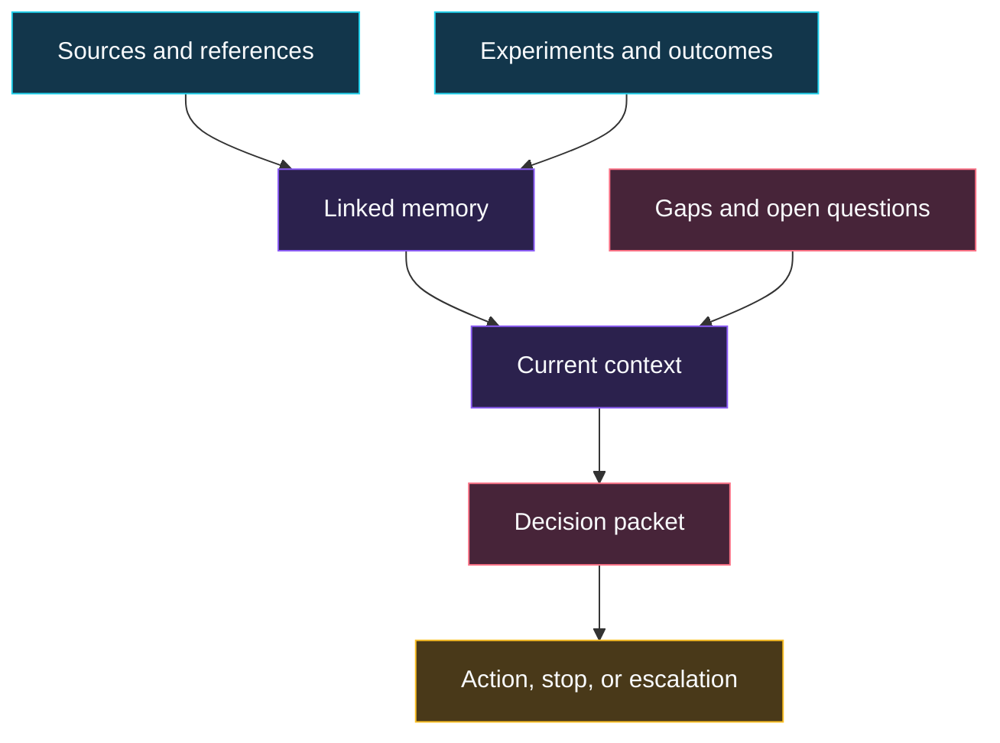

# Gauntlet Loop Brain

<p align="center">
  
</p>

<p align="center">
  <code>AI agents</code> · <code>multi-agent systems</code> · <code>Obsidian</code> · <code>evaluation</code> · <code>agent governance</code> · <code>human in the loop</code>
</p>

<p align="center">
  <a href="https://www.skool.com/ai-marketing-hub">Free AI Marketing Hub</a>
  ·
  <a href="https://www.skool.com/ai-marketing-hub-pro">AI Marketing Hub Pro</a>
  ·
  <a href="RELEASE_NOTES.md">Release notes</a>
  ·
  <a href="docs/PUBLIC_READINESS_AUDIT.md">Public-readiness audit</a>
  ·
  <a href="LICENSE">Apache 2.0</a>
  ·
  <a href="SECURITY.md">Security</a>
</p>

Gauntlet Loop Brain is an evidence-gated Obsidian brain for designing, running, evaluating, and governing one-prompt multi-agent improvement loops.

The central thesis is simple: one prompt is the control surface, while the
quality comes from a capable harness, an inspectable reference, protected
verification, coupling-aware delegation, integration discipline, and bounded
iteration. The brain keeps the memorable method and removes the folklore that
more agents, more rounds, or harsher adjectives guarantee success.

<p align="center">
  
</p>

## At a Glance



The loop does not run forever. It stops when the evidence passes, progress
plateaus, a regression appears, the budget ends, or a human intervenes.

**Current maturity:** demo-verified research prototype. The structural,
research, domain-adapter behavior, strict-vault, package-safety, and test gates
pass. The repo is not market-ready because buyer demand, retention, and
equal-budget advantage over simpler workflows remain unvalidated. Those market
claims are separate from publication safety. The repository uses the Apache
License 2.0. An experimental public release is allowed only after clean Git
commit provenance is available, the repository target and exact private-reporting
URL agree, and the public artifact safety gates pass. Until then, every package
is internal only.

It ships two artifacts:

- `assets/template-brain/` - the distributable Obsidian vault.
- `SKILL.md` plus `scripts/` - the agent-facing operating layer.

## What the Brain Remembers



It keeps evidence, outcomes, gaps, and decisions connected. It does not treat
model memory or confident prose as proof.

## Buyer

AI operators, brain authors, product builders, and AI Marketing Hub maintainers who need ambitious autonomous work without unbounded cost, self-grading, or unverifiable quality claims.

## Outputs

- Gauntlet fit decision with reasons and confidence
- One-prompt job contract with goal, reference, constraints, authority, and stop policy
- Reference and rubric card with observable dimensions and protected gates
- Coupling-aware work graph with builder, critic, integrator, and human roles
- Iteration ledger with evidence, critic verdicts, regressions, cost, and plateau signals
- Final acceptance packet separating achieved quality from aspirational language
- AI Marketing Hub integration adapter and opt-in rollout checklist

## Quick Start

```bash
python -m pip install -e .
gauntlet-loop-brain demo
gauntlet-loop-brain lint --vault examples/sample-vault
gauntlet-loop-brain report --vault examples/sample-vault --html-only
gauntlet-loop-brain validate-job tests/fixtures/gauntlet-job.json
```

To inspect the operating contract before creating a vault, start with:

- `SKILL.md`
- `docs/GAUNTLET_JOB_CONTRACT.md`
- `tests/fixtures/gauntlet-job.json`
- `docs/AI_MARKETING_HUB_INTEGRATION.md`
- `assets/template-brain/wiki/flows/Gauntlet Fit and Reference Gate.md`

To install the skill surfaces into a supported local agent directory:

```bash
./install.sh --target codex
./install.sh --target all
```

Installed directories carry `.gauntlet-loop-brain-owned`. Upgrades use a staged
replacement and refuse symlink destinations, files, or directories without the
exact ownership marker. An exact hashed installation manifest also makes both
upgrade and uninstall fail closed when owned files changed or user-added content
would be removed. Gemini loader updates reject symlinks and replace regular
files atomically. `uninstall.sh` applies the same checks before removal.
Deterministic race tests swap the loader to a symlink immediately before each
install or uninstall mutation and prove the external target remains unchanged.

This protects honest users from accidental overwrite and deletion. It is not a
security boundary against a process running as the same OS user, because that
process can rewrite both installed bytes and the local inventory. Use filesystem
permissions, a separately trusted package manager, or signed release verification
when hostile same-user tampering is in scope.

The public Claude of Duty example is preserved as both evidence and warning. It
improved substantially, but it did not beat Call of Duty in its own blind
comparison. Its repository also reports that sequential ownership beat broad
parallel fan-out for coupled rendering concerns. This brain therefore treats
`improved_not_passed` as an honest outcome and routes by coupling before it
spawns builders.

To create a client vault:

```bash
gauntlet-loop-brain new acme --client-name "Acme Co" --owner "Daniel Agrici" --out-dir ~/gauntlet-loop-brain-vaults
gauntlet-loop-brain ingest --vault ~/gauntlet-loop-brain-vaults/acme --file tests/fixtures/sample-source.md
gauntlet-loop-brain synthesize --vault ~/gauntlet-loop-brain-vaults/acme
gauntlet-loop-brain visuals --vault ~/gauntlet-loop-brain-vaults/acme
gauntlet-loop-brain report --vault ~/gauntlet-loop-brain-vaults/acme --html-only
gauntlet-loop-brain next --vault ~/gauntlet-loop-brain-vaults/acme
```

## Boundaries

The brain is advisory by default. Building or fixing can authorize ordinary
reversible edits in the declared workspace, but it does not independently
authorize commits, pushes, publishing, deployment, spending, account changes,
third-party contact, or production and system-wide changes.

Domain claims are release-blocked until `references/current-requirements.md`,
`references/market-research.md`, `references/source-map.md`, and
`references/source-ledger.json` contain dated source material from trustworthy
sources.

## Community

- [Free AI Marketing Hub](https://www.skool.com/ai-marketing-hub): learn, share, and explore the community.
- [AI Marketing Hub Pro](https://www.skool.com/ai-marketing-hub-pro): deeper implementation support and member resources.

Community membership does not change this brain's evidence, authority, safety,
or release gates.

## Maturity Gates

1. Scaffolded: product shell, vault, source pack, scripts, tests, and demo exist.
2. Researched: dated trustworthy sources replace placeholder research.
3. Domain-adapted: real domain importer, synthesis, reports, fixtures, and tests exist.
4. Demo-verified: sample vault regenerates deterministically and reports cite sources.
5. Market-ready: audit score is at least 90 with no critical failures.

Scores are capped by maturity. A scaffold cannot become market-ready by edited
markdown alone.

## Research Policy

Use official, primary, or vendor documentation first. Use market or practitioner
sources only as supporting evidence. Do not treat blog roundups or AI summaries
as primary truth. Record evidence in `references/source-ledger.json`; prose-only
research notes do not satisfy the gate.

## Release

```bash
python scripts/package_release.py --version 0.1.0
python scripts/package_release.py --version 0.1.0 --release-type experimental
python scripts/package_release.py --version 1.0.0 --release-type market-ready
```

Release tags use `vMAJOR.MINOR.PATCH`. Prerelease candidates use
`vMAJOR.MINOR.PATCH-rc.N`. No Git tag is created until its exact clean commit,
release manifest, checksums, license, and release notes have passed review.

The default `scaffold` release and the optional `demo` release are always
internal-only, even if publication prerequisites exist. `experimental` is the
public research-tool release. It can set `publication_ready: true`, but it must
always set `market_ready: false` and record buyer demand, retention, and
equal-budget advantage as unvalidated. `market-ready` remains a stronger,
separate gate and still requires `scripts/audit_brain.py --require market-ready`.

Release packaging scans for secrets, local paths, symlinks, untracked drift,
unsafe ZIP entries, and unsupported positive market claims before writing
`dist/RELEASE_MANIFEST.json` and `dist/SHA256SUMS`. Public archives exclude the
private paths listed in `PUBLISHING_NOTICE.md`. The public vault archives retain
`hot.template.md` and `log.template.md`; the scaffold command instantiates the
private runtime `hot.md`, `log.md`, and `.raw/.manifest.json` files locally.
Extracted public archives are linted during the pipeline. The repository
maturity audit never grants publication readiness. Only a successfully produced
release manifest can do so for one exact artifact set.
Market-ready packaging fails closed on those publication blockers and also runs
`scripts/audit_brain.py`.
